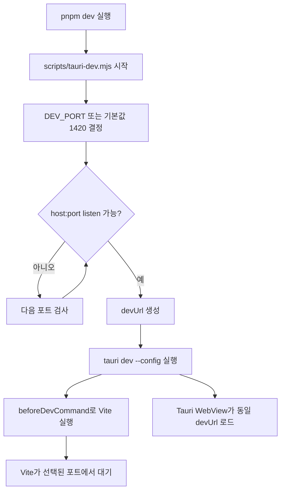

# 개발 서버 및 앱 실행 시 동적 포트 적용

## 배경

Tauri 개발 실행은 프론트엔드 개발 서버와 데스크톱 앱 실행이 함께 맞물린다. 고정 포트만 사용하면 이미 다른 프로젝트나 이전 실행 프로세스가 같은 포트를 사용 중일 때 `pnpm dev`가 실패한다.

## 적용 방식

루트 `pnpm dev`는 `scripts/tauri-dev.mjs`를 실행한다. 이 스크립트는 `DEV_PORT` 또는 기본 포트 `1420`부터 사용 가능한 포트를 탐색하고, 선택된 포트를 Tauri CLI의 `--config` 옵션으로 전달한다.

선택된 포트는 다음 두 위치에 동시에 반영된다.

```json
{
  "build": {
    "devUrl": "http://127.0.0.1:<port>",
    "beforeDevCommand": "pnpm exec vite --host 127.0.0.1 --port <port> --strictPort"
  }
}
```

`--strictPort`를 유지하는 이유는 래퍼가 이미 포트를 결정했기 때문이다. Vite가 다시 다른 포트로 이동하면 Tauri `devUrl`과 불일치할 수 있으므로, 선택된 포트에서 실행할 수 없으면 즉시 실패하게 둔다.

## 실행 흐름



## 환경 변수

- `DEV_PORT`: 탐색을 시작할 포트다. 없으면 `1420`을 사용한다.
- `PORT`: `DEV_PORT`가 없을 때 대체 시작 포트로 사용한다.
- `DEV_HOST`: 개발 서버 host다. 없으면 `127.0.0.1`을 사용한다.
- `TAURI_DEV_HOST`: Tauri 모바일/네트워크 실행 환경에서 전달될 수 있는 host이며 `DEV_HOST`보다 우선한다.

## 주의점

포트 탐색과 실제 Vite listen 사이에는 짧은 경쟁 구간이 있다. 같은 순간 다른 프로세스가 동일 포트를 선점하면 Vite가 `--strictPort`로 실패할 수 있으며, 이 경우 다시 실행하면 다음 가능한 포트를 새로 탐색한다.
