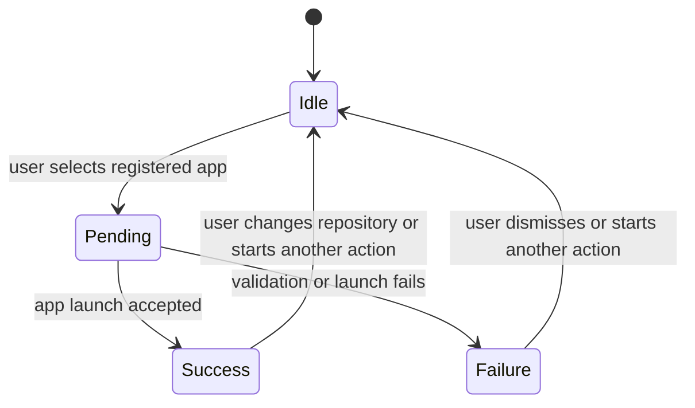

# Data Model: repo 디렉토리 등록 앱으로 열기

## Repository

Represents a local git repository shown in the repo detail screen.

### Fields

- `id`: absolute repository path used as stable repository identifier
- `name`: display name
- `path`: absolute repository directory path
- `relativePath`: user-facing shortened path
- `isWorktree`: whether the repository is a linked worktree
- `metadata`: user-managed description, tags, and pin state

### Validation Rules

- `id` and `path` must resolve to the same local directory for app open actions.
- The directory must still be accessible when the user opens it.
- The directory must still be recognized as a git repository before launch.

## RegisteredApp

Represents an app that can open a repository directory.

### Fields

- `id`: stable app id used in command requests
- `label`: user-visible app name
- `kind`: app category such as file manager, terminal, or editor
- `availability`: whether the app is expected to be launchable in the current environment
- `availabilityMessage`: optional user-facing reason when the app is not expected to launch
- `order`: deterministic sort position

### Initial Values

- `finder`
- `ghostty`
- `kitty`
- `wezterm`
- `vscode`

Existing apps such as `terminal` and `iterm2` may remain supported if already exposed, but the feature acceptance focuses on the requested registered apps.

### Validation Rules

- `id` must be one of the supported registered app ids.
- `label` must be stable and recognizable.
- Ordering must be deterministic across menu openings.
- Unavailable apps may be displayed disabled or may produce a clear failure on launch, but the user must be able to identify the failed app.

## OpenRepositoryAppRequest

Represents the user request to open the current repository directory in a selected app.

### Fields

- `repositoryId`: absolute repository path
- `app`: registered app id

### Validation Rules

- `repositoryId` must not be empty.
- `repositoryId` must reference an accessible git repository directory.
- `app` must be a supported registered app id.

## OpenRepositoryAppResult

Represents the result of trying to open a repository directory.

### Fields

- `status`: `success` or `failure`
- `app`: selected registered app id
- `repositoryPath`: target absolute path
- `message`: user-facing result message

### State Transitions

